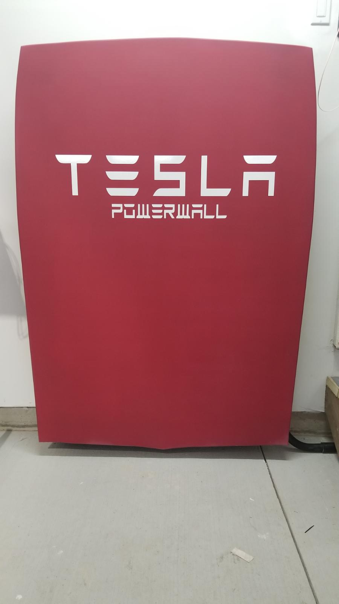
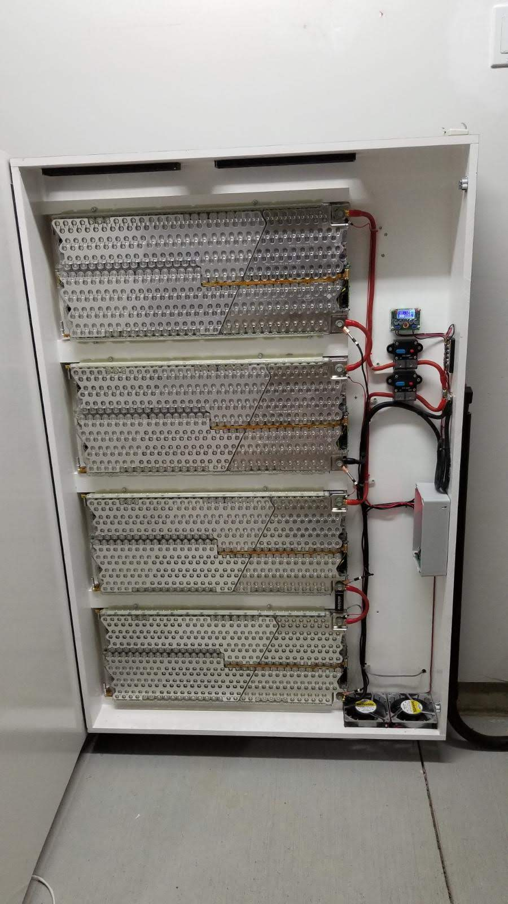

<!-- Header -->

   

  <!-- Logo -->
  

  <!-- Title -->
  ### HomeFront

  <!-- Description -->
  Offgrid Battery Monitor

  <!-- Repo badges -->
  
  
  

  <!-- Links -->

  ---
  

    <a href="https://git.zakscode.com/ztimson/homefront/releases" target="_blank">Release Notes</a>
    • <a href="https://git.zakscode.com/ztimson/homefront/issues/new?template=.github%2fissue_template%2fbug.md" target="_blank">Report a Bug</a>
    • <a href="https://git.zakscode.com/ztimson/homefront/issues/new?template=.github%2fissue_template%2fenhancement.md" target="_blank">Request a Feature</a>
  

  ---

## Table of Contents
- [HomeFront](#top)
    - [About](#about)
        - [Built With](#built-with)
    - [Setup](#setup)
        - [Development](#development)
    - [License](#license)

## About

 

After obtaining 4 Tesla battery modules, I was contracted to build a device to record battery voltages & temperatures. This was accomplished using some custom circutry and
an arduino. These input values were then read by a Raspberry Pi & published to a web UI for remote viewing.

Later on the arduino was removed and the raspberry pi was directly interfaced with an upgraded Battery Charging Module which was able to read values directly from the batteries
onboard computer.

The code is split into two pieces:
 - Website for viewing data
 - Arduino & Raspberry Pi code to collect & publish battery data

### Built With

## Setup

  <h3 id="development" style="display: inline">
    Development
  </h3>

#### Prerequisites
- [Node.js](https://nodejs.org/en/download)

#### Instructions
1. Install the dependencies: `npm install`
2. Start the Angular server: `npm run start`
3. Open [http://localhost:4200](http://localhost:4200)

## License
Copyright © 2023 Zakary Timson | All Rights Reserved

See the [license](./LICENSE) for more information.
